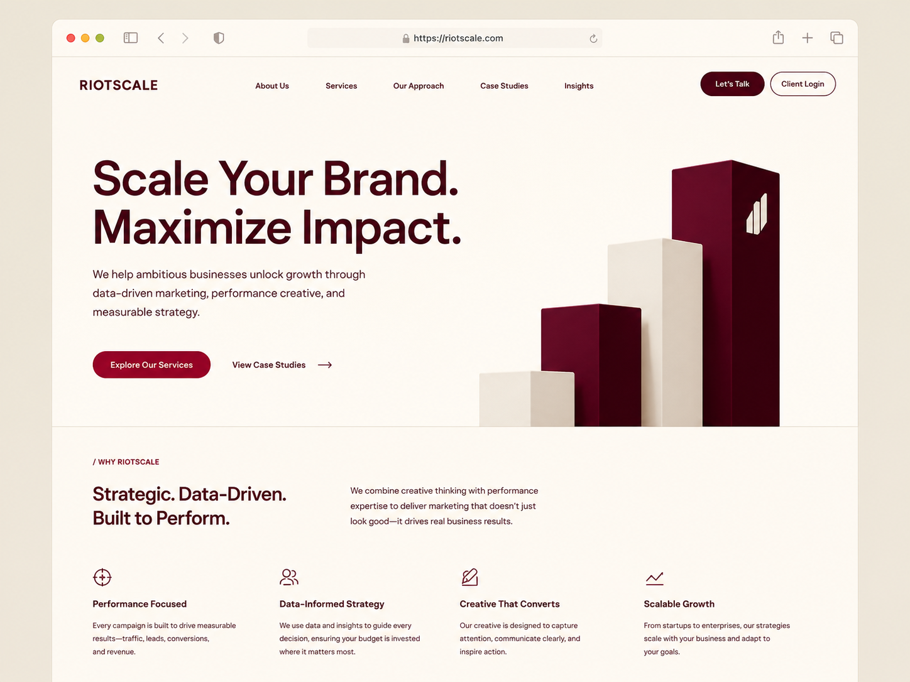

# Riotscale Website Context

## Project
Riotscale is a premium marketing company website built with Astro.
This is a static frontend only. No backend, database, login logic, or form handling yet.

## Visual Direction
The site should feel premium, minimal, strategic, and high-end.
Use the attached reference image as the main visual direction.

Use this image as the primary visual direction:

The goal is not to copy it pixel-for-pixel. Match the general layout, color palette, spacing, and premium minimal feel.

Design traits:
- Warm cream/off-white background
- Deep burgundy typography
- Crimson/burgundy CTA buttons
- Lots of whitespace
- Editorial, polished layout
- Subtle borders and soft shadows
- Abstract geometric growth/block visual
- No stock photos
- No bright gradients
- No generic SaaS blue

## Layout and Styling Baseline
Use the existing homepage structure as the baseline for new pages.

Top-level page frame:
- Keep the beige page background outside the site frame.
- Wrap page content in the `.page-shell` framed card.
- The shell should remain responsive and close to the viewport edge on desktop:
  - `width: calc(100% - 64px);`
  - `margin: 32px auto;`
  - subtle border, rounded corners, soft shadow, and `overflow: hidden`
- On mobile, reduce the shell gap to 20px total and lower the radius.

Internal content width:
- Use the reusable `.container` class for primary page content.
- Current baseline:
  - `width: min(100% - clamp(2rem, 6vw, 8rem), 1500px);`
  - `margin-inline: auto;`
- Apply `.container` to nav/header inner content, hero inner content, and section inner content.
- The outer shell can be wide, but content should not stretch all the way to the shell edges on large monitors.

Hero layout:
- Keep the hero editorial and spacious, but avoid excessive horizontal gaps.
- Use a centered two-column grid for desktop hero composition:
  - text column around `minmax(0, 760px)`
  - visual column around `minmax(320px, 520px)`
  - `column-gap: clamp(3rem, 5vw, 6rem)`
- Do not push the hero visual to the far right edge; use `justify-self: center` or `start`.
- Do not make the headline significantly larger than the current homepage headline.
- Use the provided abstract block image asset for the hero visual rather than rebuilding it with CSS blocks.

Section layout:
- Sections should keep full-width bands/borders inside the framed shell when useful.
- Section content should sit inside `.container`.
- Preserve the premium minimal tone: restrained spacing, subtle borders, soft shadows, and no decorative clutter.

## Tech
- Astro
- Static pages
- Componentized sections
- Minimal TypeScript
- Semantic HTML
- Responsive CSS
- CSS variables for colors/spacing/type

## Page Sections
Initial scope:
1. Navbar
2. Hero
3. Why Riotscale

Later:
4. Services
5. Our Approach
6. Case Studies
7. Insights
8. Footer

## Copy
Hero headline:
Scale Your Brand. Maximize Impact.

Hero body:
We help ambitious businesses unlock growth through data-driven marketing, performance creative, and measurable strategy.

Primary CTA:
Explore Our Services

Secondary CTA:
View Case Studies →

Why section heading:
Strategic. Data-Driven. Built to Perform.

Feature cards:
- Performance Focused
- Data-Informed Strategy
- Creative That Converts
- Scalable Growth
